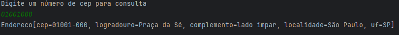
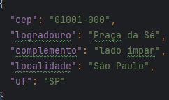

# 🛣️ Projeto ViaCep 🛣️

---

#### 🚩 G7 ONE | Java e Orientação a Objetos | Java: consumindo API, gravando arquivos e lidando com erros 🚩
#### 🌎 [@Alura](https://www.alura.com.br/) | [@One](https://www.oracle.com/br/) 

---
### Descrição

- _Criar uma classe que representa um endereço (cep, uf, cidade, bairro, logradouro e complemento);_
- _Criar uma classe que consulta a API ViaCEP para buscar um endereço a partir de um cep (exemplo: https://viacep.com.br/ws/04101300/json);_
- _Criar uma classe que cria um arquivo json contendo os dados de um objeto Endereco;_
- _Criar uma classe com método main que deve solicitar ao usuário que informe um CEP e na sequencia utilizar as classes para consultar a api ViaCEP e salvar os dados do endereço em um arquivo json_

---

### Observações:
- _API utilizada: (https://viacep.com.br/ws/04101300/json);_
- _Biblioteca utilizada: Gson (https://mvnrepository.com/artifact/com.google.code.gson/gson/2.10.1) versão 2.10.1;_

---
### Tela inicial:
_Ao executar a aplicação você deverá digitar o CEP desejavél a ser buscado, após inserir e confirmar voltará as informações(`CEP`, `uf`, `cidade`, `bairro`, `logradouro` e `complemento`) do CEP buscado._

> 

### Histórico de busca:
_Após a primera busca de CEP, será gerado um arquivo `.json` com cada busca gerado nessa aplicação._

> 

>

